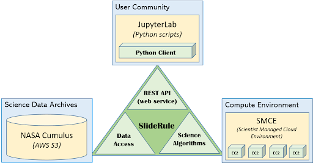
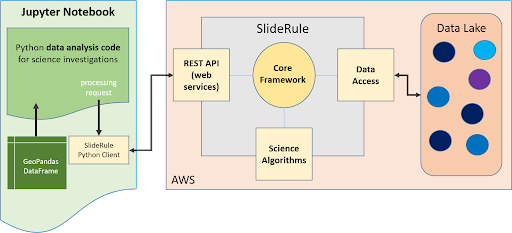
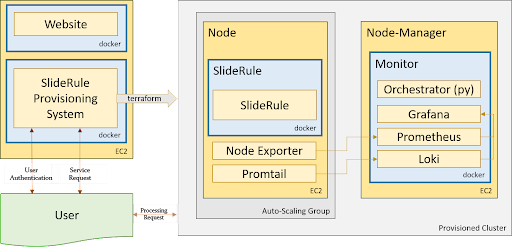

## What Is SlideRule?

SlideRule is a server-side framework implemented in C++/Lua that provides REST APIs for on demand science data processing. SlideRule can be used by researchers and other data systems for low-latency access to customized data products that are generated using processing parameters supplied at the time of the request with results returned in real-time.

The development of SlideRule is led by the University of Washington in conjunction with NASA’s ICESat-2 program. The University of Washington is currently running an instantiation of SlideRule in AWS us-west-2, accessible at http://icesat2sliderule.org.  This deployment supports science investigations using ICESat-2’s ATL03, ATL06, and ATL08 datasets, and has direct access to those datasets in AWS S3 through NASA’s Cumulus program.

Every deployment of SlideRule consists of three major sets of components which are supported by the SlideRule framework: the REST APIs (or web services), the data access interfaces, and the science algorithms.

Figure 1: Components of University of Washington’s SlideRule Deployment

Web services provided by SlideRule can be accessed by any http client (e.g. curl); but a Python client (https://github.com/ICESat2-SlideRule/sliderule-python) is provided by the project to make it easier to interact with SlideRule. The Python client provides functional interfaces for processing science data: processing parameters are passed to the client’s API, all the necessary requests to the SlideRule servers are performed inside the client and the responses handled, and then the results are collected into a GeoDataFrame and returned back to the calling code.  Future releases of SlideRule will include clients for other popular programming languages like Julia and R.

Data accessed by SlideRule can reside anywhere and be in any format, as long as an appropriate driver is provided.  SlideRule treats all datasets as “assets” and requires each asset to be registered in an “asset directory” which provides the asset’s location, format, and associated code needed to access and read the asset.  Currently, SlideRule supports HDF5 data stored locally and in S3.  New data formats and storage systems are added as needed and will be included in future releases.

Science algorithms available to SlideRule are implemented in C++ and Lua code and run inside the SlideRule framework on each server.  They are invoked by calls to the web services, and utilize the data access code to pull in the requested datasets for processing.  Currently, the customization of the algorithm processing is limited to predefined parameters made available by the code and exposed to the web service.  Future releases of SlideRule will support running sandboxed Lua code provided by users at the time of the request.

## Why Develop SlideRule?

Our goal is to model a fundamental change in the way Earth science data is distributed by institutions and interacted with by data users.  Current approaches to science data access center around data archives.  Institutions pre-generate datasets which are archived and made available via data centers.  Data users download parts of those datasets from the data centers and perform local processing and analysis.  SlideRule models an approach that is centered around services.  Institutions make science data available via web services, and data users integrate those web services directly into their existing data analysis systems.

The tremendous growth in the size of datasets being produced by institutions over the past ten to fifteen years has broken the data archive model. When datasets changed from being a few hundred Gigabytes to hundreds of Terabytes (and now Petabytes), comprehensive analysis of those datasets using existing technology became impossible. Workstations running MatLab needed to be replaced by clusters running Dask.  Data transit replaced data processing as the dominant driver of time. Data storage replaced data processing as the dominant driver of resources.

> As a concrete example, consider that the original NASA ICESat mission, which launched in 2003, produced 148GB of global elevation data.  That data could be downloaded at 6MBps in just under 1 day, stored on a single harddrive on a single workstation, and directly analyzed forever after.  ICESat-2 (the follow-on mission), launched in 2018 and to date has produced 320TB of data with 100TB of data being added each year.  In order to download the existing dataset at 100MBps, it would take 296 days, and require 40 workstations with 8TBs of storage each to hold.  To address this challenge, SlideRule provides access to ICESat-2 data via services which perform large scale data processing steps next to the data and return higher level results back to the data users.  This approach significantly lowers the barrier of entry for using ICESat-2 data.

Performing comprehensive analysis on current Earth science datasets requires sophisticated compute and storage infrastructure, and high bandwidth connectivity to the data sources; both of which are insurmountable barriers of entry to all but our most funded institutions.
The interim solution to this problem currently offered by NASA is the pre-generation and distribution of higher level data products which target specific science applications.  By targeting a narrow application these data products are smaller and therefore easier to download and work with.  The problem with this interim solution is that these applications need to be selected ahead of time and naturally limit what can be done with the data.  Unforeseen applications, and even small modifications to those applications cannot be handled.  Science discovery requires the exploration of new relationships in data.  By pre-selecting and hard-coding which relationships can be analyzed, the use of pre-generated higher level data products greatly limit what can be done with the datasets our missions produce.

Moving to a service model for data distribution addresses all of these problems.  Institutions which produce datasets distribute those datasets by building out (on-premise or in the cloud) the infrastructure needed to store and process the data, and make all of it directly accessible by data users.

Users choose the science application, not the institution: Instead of data users downloading pre-generated data products, data users make processing requests to the data service and receive back customized data products tailored to their science application based on the parameters they supplied in their request.

Institutions provide the compute as well as the data: Instead of data users needing to set up a cluster in order to run their data analysis, the sophisticated compute and storage infrastructure needed to manage and process the lower level data is provided by the institution, freeing up the data user to focus on their scientific investigation.

New algorithms can be added at any time: Instead of institutions running multiple pipelines to produce data products that are released on fixed schedules, institutions run multiple services and new services can be added at any time and have access to all of the data (current and historical) immediately.

Improvements and fixes are immediately available: Instead of institutions having to replace old versions of data products when processing improvements and fixes are made, and then requiring data users to redownload those data products, institutions deploy improvements and fixes to their services and it immediately becomes available to data users.

Services build on each other:  When institutions move to a service-based model for data distribution, those services can be integrated into other systems and produce synergetic benefits.  A data archive stands alone, and the only way to avoid duplicating efforts between different archives is to combine and centralize the functionality. But a data service can be integrated with and leverage other data services while still remaining decentralized.  Footnote: [For example, one university could build a data service that leverages the public API of another university’s data service to produce a combined data product without ever having to rehost the other university’s data.  From a technical implementation standpoint, the two universities remain distinct, decentralized entities, yet by providing their data as a service, they allow for combined data products.]

## What are SlideRule’s Goals?

In developing SlideRule, the team has five goals that we believe are necessary to successfully demonstrate a viable service-based data distribution approach.  Those goals are:

### (1) Cost Effective

The system must have near zero costs when not in use, and be able to scale in a cost-controlled way when demand increases.  If there is a recurring cost to support each service, then there is a disincentive to provide more services.  By designing a system that scales to zero when there is no demand, the development of different processing algorithms can be done without the burden of having to support large recurring costs once it is deployed.

Scaling costs to zero also protects against funding gaps and allows smaller institutions to use the system when funded by grants and awards, and not lose all that they’ve invested when that funding runs out.

### (2) Responsive Results

If results can be returned fast enough, the user can interact with the data in ways that are impossible in batch processing systems where they have to wait hours (or even days) to get their results.  Data analysis is often iterative, and a system that supports iterative exploration of the data and customization of the algorithms that process the data, supports the users in the way they want to work with the data.

Also, keeping latencies low allows the system to integrate with other systems with low latency requirements.  For instance, systems that provide situational awareness cannot wait hours to get a response.  If a data service takes hours to respond to a processing request, it disqualifies itself from being able to be integrated with those types of systems.

### (3) Simple API

Learning a new system incurs a real and possibly large upfront cost.  If we are building a system that is attempting to lower the cost burden of data users and relieve them of the need to make investments in their compute and storage infrastructure, we cannot then require large investments of time and personnel to be able to use our system.  That would be merely shifting the costs and creating a different barrier to entry.

### (4) Expandable

There are two ways in which a data service needs to be expandable to support new science applications: (1) the addition of new science processing algorithms, (2) the addition of new datasets.  In both cases, the data service needs to add the new functionality without increasing the overall complexity of the system and without introducing risk or regressions in the current set of available services.

### (5) Scalable

As demand increases, the system needs to scale to meet the demand. And the way the system scales needs to match the objectives and charter of the institution funding the service.  For instance, a private university may want to allow privileged access to compute resources for its own members, whereas a government agency may want to allow equal access to all available compute resources for any of its citizens.

## How Does SlideRule Work?

Figure 2: SlideRule Processing Workflow

The University of Washington’s deployment of SlideRule runs in AWS us-west-2 and consists of a set of EC2 instances that have access to NASA’s Cumulus datasets in S3, and NASA’s CMR system.  A user Python script can be running anywhere as long as it has access to the internet.  When using SlideRule’s Python client, a processing request from a user script has four primary stages:

### (1) Authentication

Users authenticate themselves and the system associates a profile with them that identifies what they can and cannot do.

### (2) Querying available processing resources

Given who the user is, the processing resources (e.g. the IP addresses of the compute nodes) available to the user are returned.

### (3) Querying available data resources

The datasets necessary to fulfill the request are queried using either geo-spatial or temporal filters, and a set of data resources (e.g. granules) are returned.  For ICESat-2, NASA’s CMR system is used to query which resources are available.

### (4) Processing the data

The set of resources that need to be processed are distributed across the available compute nodes and results are collected into a GeoDataFrame which is returned to the user upon completion of the request.

Diving down a little deeper, the fourth stage of each request – processing the data – can be further broken down into three parallel processes, each owned by the three main components of SlideRule:

Figure 3: Server-Side Processing Workflow

### Web Service

When a processing request is made to a SlideRule server, the code that handles the request instantiates a self-contained Lua runtime environment and kicks off a Lua script that is associated with the service being requested.  It then creates a pipe from the Lua script back to the end-user’s client so that any data generated by the Lua script flows back to the user as a response.

### Science Algorithms

One of the necessary steps the Lua script performs is kicking off the science algorithms that are responsible for processing the data.  Each algorithm is internally coded to process the data in a parallel fashion and therefore may kick off multiple processing threads.

### Data Interface

At the start of every algorithm, the set of data needed by the algorithm is internally requested.  SlideRule maintains a thread pool of data fetchers that receive those internal requests and perform the data reads asynchronously.  The algorithms will do as much as they can with the data they have available and will block until notified by the data fetchers when they need more data to proceed.

## What Technology is Used by SlideRule?

The main technologies used to implement SlideRule are Terraform for provisioning resources in AWS, Docker for containerizing the components of the application, and Grafana / Prometheus / Loki for observability.

Figure 4: SlideRule’s Technology

The primary unit of deployment for SlideRule is the “provisioned cluster” which consists of an AWS Autoscaling Group that runs the SlideRule processing nodes and a stand-alone EC2 instance that runs SlideRule’s monitoring system.

Each provisioned cluster is self-contained and ephemeral, meaning it is provisioned when needed, performs its tasks without requiring any other infrastructure, and is then torn down.   To do this, the entire system is defined in Terraform HCL files and created and destroyed from a terminal using Terraform commands.  The consequence of this approach is that nothing is changed in-place.  New versions of the code are deployed when new clusters are provisioned.  Security patches are applied by rebuilding base AMIs and redeploying the cluster.

When a provisioned cluster comes up, it fetches a specific set of Docker images specified in the code and starts the necessary containers from them.  For a release, those images are specific tags associated with the release.  Each container then runs code that periodically registers itself with the Orchestrator running inside the Monitor.  A registration identifies the service that the container fulfills, and provides a lifetime for the registration.  The Orchestrator keeps track of all valid registrations and provides that information on request to users querying the compute resources of the cluster.

Each EC2 instance in the cluster runs Promtail for log collection and Node Exporter for metric collection.  Those processes feed data back to the Monitor which is running Loki for log aggregation, and Prometheus for metric aggregation.  The Monitor also runs Grafana which is connected to both Loki and Prometheus and provides dashboard access to developers of the logs and metrics generated by the cluster.

## For Further Reading

For further information on SlideRule, see our website at: http://icesat2sliderule.org.

